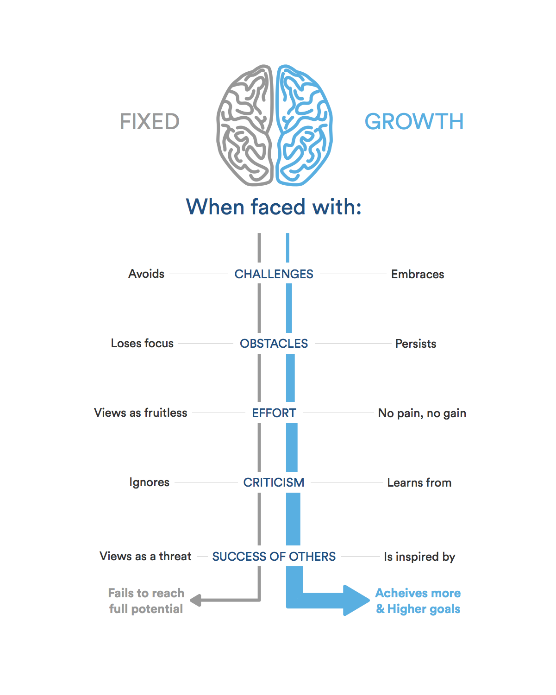

# Growth Mindset

**I am Batoul Al Wahaibi, I have a bachelor degree in English language and literature and I graduated from Al- Albayt university. I want to talk about growth mindset.**
***
## what is growth mindset? 
The ability to keep your mind active and creative through studying, exploring and practicing. 
#### Never stop give up.

Here'is a simple brief about the difference between fixed and growth mindest:

## How to keep yourself in a growth mindset?
 1. Don't give up when you face a lot of problems and obstacles, be always optimistic and try to learn from your experience.

2. Give an extra efforts to all your duties and make a plan every day for what you should to do>

3. Learn from success of others and try to connect our works together.

### For more information visit [Growth Mindest](https://www.atlassian.com/blog/inside-atlassian/growth-mindset)
