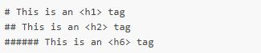
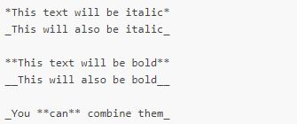
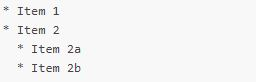
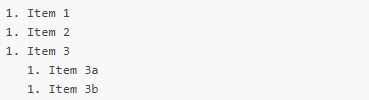
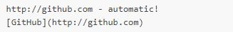
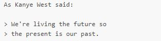
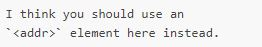

# Reading-Notes 
# Markdown
markdown is an easy method to create and design text on github platforms, how the text look like; big, **bold**, *italics*, adding images, adding lists etc.

It's like I'm having or creating file and this file will be like a documentation for something I use in my application, the file like I'm sharing informotion.

## Examples

1. Headers
***

***
2. Emphasis

3. Lists
 * Unordered 

 

 * Ordered

 

 4. Links

 

5. Blockquotes
 
 

 6. Inline code

 