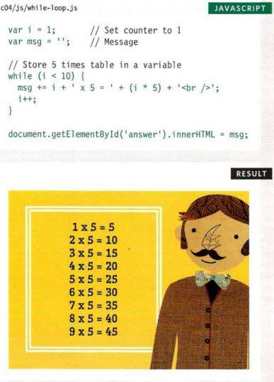
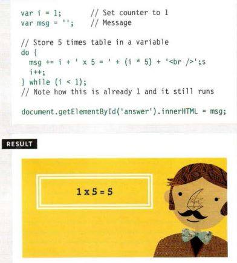

# Comparison Operators

### Evaluatin Conditins
 You can evaluate a situation by comparing one value in the script what you expect it might be. 
The result will boolean: **True** or **False**

* == EQUAL TO compares two values to see if they are the same

* != NOT EQUAL compares two values if they are not the same
* === STRICT EQUAL TO compares two values to check that the both data type and value are the same

* !== STRICT NOT EQUAL TO compares two values to check that the both data type and value are not the same
* > GREATER THAN checks if the number on the left is greater than the number on the right
* < LESS THAN checks if the number on the left is less than the number on the right
* >= GREATER THAN OR EQUAL TO checks if the number on the left is greater or equal to the number on the right
* <= LESS THAN OR EQUAL TO checks if the number on the left is less or equal to the number on the right

# Logical Operators

## Loops
Loops check a condition. If it returns true,a code block will run.
Then the condition will be checked again if it still returns true, the code block will run again. it repeats until the condition return false.

### There are three types of loops:
1. For

2. While

3. Do While

