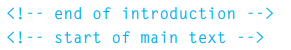

# Process and Design
The website should be designed for the target audience not for yourself or the site owner.
### Who will visit our website and know what the information the visitor need to show it in the site, we should create a design that attract the visitor.
## How can you understand your target audience?
- Target Audience: individuals
● What is the age range of your target audience?
● Will your site appeal to more women or men? What is the mix?
● Which country do your visitors live in?
● Do they live in urban or rural areas?
● What is the average income of visitors?
● What level of education do they have?
● What is their marital or family status?
● What is their occupation?
● How many hours do they work per week?
● How often do they use the web?
● What kind of device do they use to access the web?
- Target Audience: Companies
● What is the size of the company or relevant department?
● What is the position of people in the company who visit your site?
● Will visitors be using the site for themselves or for someone else?
● How large is the budget they control?
### Why people visit your website?
now we need to know how the visitors are then need to consider why the are visiting the site.
to consider why people visit our site we should mention two basic categories:
1. Try to discover **motivations** for why people come to your site.
2. Examines the specific **goals** of the visitors.
***
 We should try to know what information the visitors need and how often they will visit the site.
***
## Site map
site map allow the visitor to plan the structure of a site to help you to decide what information should go on each page.

## WireFrames
a WireFrame allow the user to organize the information that will need to go on each page.

***
### Getting your message across using design:
The primary aim of any kind of visual design is to communicate. Organizing and prioritizing information on a page helps users understand its importance and what order to read it in.
### visual hierarchy
Attention is immediately drawn to a picture that shows the service this company offers and a headline to explain it
It helps visitor understand what are trying to tell them.

# Extra Markup
## The Evolution of HTML
we have different versions of HTML each new version was designed to be an improvment on the last with more elements.
different versions of HTML:
1. HTML4 (released 1997)
2. XHTMML 1.0 (released 2000)
3. HTML5 (released 2000)
HTML5: it's not completed but we can take advantage of the new features of the language.
#### we have several versions of HTML and each web page should begin with a DOCTYPE declaration to tell browser wich versions of HTML the page is using>
 
 
## Comments in HTML
you can add a comment to your code that will not appear to the user's browser.

## ID Attribute
we can use ID Attribute to uniquely identify that elements from other elements.
image
## Block Elements
this element will appear to start an a new line in the browser window
example: <h1>, <al>, and <li>

## Inline Elements
this elements will always appear to continue on the same line as their neighbouring elements>
example: <a>, <b>, and 

### IFrames

An iframe is like a little window that has been cut into your page

 and <spam> elements allow you to group block-level and inline element together.
## escape characters
used to include special character in your pages such as <,>, and
 meta this element iside the head  contains information about that web page.