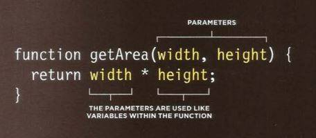
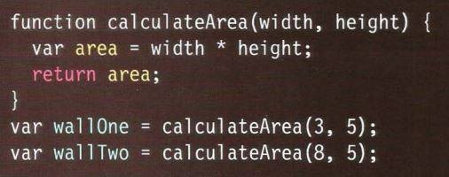

# HTML & CSS

* HTML elements are added to the content of page to describe it's structure.

# What is a script and how do I create one?

A script is a series of instructions that a
computer can follow to achieve a goal. 
Scripts are made of instructions a computer can follow step-by-step.
a browser may use different parts of the script depending on how the user interacts with web page.
Scripts can run differennt sections of the code in response to the situation around them.

### WRITING A SCRIPT 
To write a script, you need to first state your goal and then list the tasks that need to be completed in order to achieve it.

### Designing a script:
*Tasks*

Once you know the goal of your script, you can work out the individuals tasks needed to achieve it.
Each individual task may be broken down into a sequence of steps, when you are ready to code the script, these steps can then be translated into individual lines of code.

### FROM STEPS TO CODE 
Every step for every task shown in a flowchart needs to be written in a language the computer can understand and follow. 

### DEFINING A GOAL & DESIGNING THE SCRIPT 
Consider how you might approach a different type of script.
This example calculates the cost of a name plaque. 
Customers are charged by the letter. 

### SKETCHING OUT THE TASKS IN A FLOWCHART 
Often scripts will need to perform different tasks in different situations.
You can use flowcharts to work out how the tasks fit together.
The flowcharts show the paths between each step. 

## EXPRESSIONS 

An expression evaluates into (results in) a single value.
 Broadly speaking there are two types of expressions:

1.EXPRESSIONS THAT JUST ASSIGN A VALUE TO A VARIABLE  
example: var color = 'beige'; 

2. EXPRESSIONS THAT USE TWO OR MORE VALUES TO RETURN A SINGLE VALUE
example var area = 3 * 2; 

Expressions rely on things called *operators* ; they allow programmers to create a single value from one or more values. 

### ARITHMETI C OPERATORS 
JavaScript contains the following mathematical
operators, which you can use with numbers.
You may remember some from math class. 

### STRING OPERATOR 
There is just one string operator: the+ symbol.
It is used to join the strings on either side of it. 

example: 
***

### WHAT IS A FUNCTION? 
Functions let you group a series of statements together to perform a
specific task. If different parts of a script repeat the same task, you can
reuse the function (rather than repeating the same set of statements). 

#### A BASIC FUNCTION 
example: 
***

#### DECLARING A function
example: 
***

#### CALLING A FUNCTION

example:
***

#### DECLARING function THAT NEED INFORMATION

example:
***

#### Getting a single value out of a function 

example: 
***
