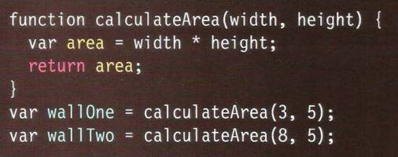

### WHAT IS A FUNCTION? 
Functions let you group a series of statements together to perform a
specific task. If different parts of a script repeat the same task, you can
reuse the function (rather than repeating the same set of statements). 

#### A BASIC FUNCTION 
example: 

***

#### DECLARING A function
example: 

***

#### CALLING A FUNCTION

example:

***

#### DECLARING function THAT NEED INFORMATION

example:

***

#### Getting a single value out of a function 

example: 

***
