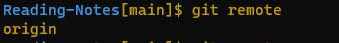

# Seeing Your Remote

* When you run the command **git remote**  you can view the short names such as "origin" of all specified remote handles.

* When you run the command **git remote v-** you can view all the remote URL next their corresponding short names.

